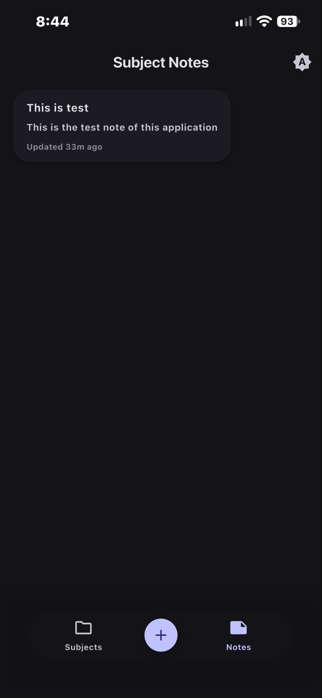
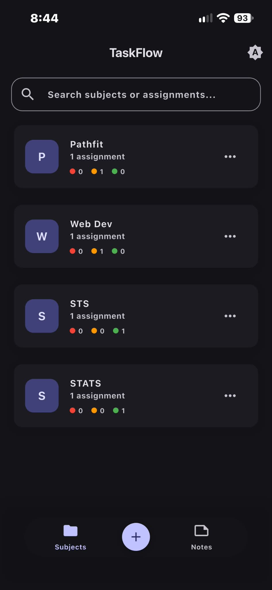

> 🍎 **iOS only for now.** TaskFlow is currently available for iOS devices only. Android support is planned for a future release — stay tuned!

# 📋 TaskFlow

TaskFlow is a simple and intuitive **Flutter** app for managing your assignments and tasks. Add what you need to do, track your progress, and mark items as complete once you're done — all in one clean, organized place.


---

## ✨ Features

- ➕ **Add Assignments** — Quickly create new tasks with a title, description, and due date.
- ✅ **Mark as Done / Undone** — Toggle completion status with a single tap.
- 📝 **Edit & Delete** — Update task details or remove tasks you no longer need.
- 📅 **Due Date Tracking** — Stay on top of deadlines with clear date indicators.
- 🔍 **Filter & Sort** — View tasks by status (pending/completed) or sort by due date.
- 🎨 **Clean, Minimal UI** — Distraction-free design so you can focus on getting things done.
- 💾 **Local Storage** — Your tasks are saved on-device, no internet required.

---

## 📱 Screenshots

<p align="center">
  
  
</p>

---

## 🛠️ Built With

- [Flutter](https://flutter.dev/) — UI toolkit for building natively compiled apps
- [Dart](https://dart.dev/) — Programming language
- *(add any packages you're using, e.g. `provider`, `sqflite`, `shared_preferences`, `hive`)*

---

## 🚀 Getting Started

### Prerequisites

Make sure you have the following installed:

- [Flutter SDK](https://docs.flutter.dev/get-started/install)
- [Dart SDK](https://dart.dev/get-dart) (comes bundled with Flutter)
- Android Studio / VS Code with Flutter & Dart plugins
- An emulator or physical device for testing

### Installation

1. **Clone the repository**
   ```bash
   git clone https://github.com/your-username/taskflow.git
   cd taskflow
   ```

2. **Install dependencies**
   ```bash
   flutter pub get
   ```

3. **Run the app**
   ```bash
   flutter run
   ```

---

## 📂 Project Structure

```
taskflow/
├── lib/
│   ├── main.dart          # App entry point
│   ├── models/            # Data models (Task, etc.)
│   ├── screens/           # App screens/pages
│   ├── widgets/           # Reusable UI components
│   └── services/          # Local storage / business logic
├── assets/                 # Images, icons, fonts
├── pubspec.yaml
└── README.md
```

---

## 🗺️ Roadmap

- [ ] Push notifications for upcoming deadlines
- [ ] Dark mode support
- [ ] Cloud sync across devices
- [ ] Categories/tags for assignments
- [ ] Widgets for home screen

---

## 🤝 Contributing

Contributions are welcome! If you'd like to help improve TaskFlow:

1. Fork the repository
2. Create a new branch (`git checkout -b feature/your-feature`)
3. Commit your changes (`git commit -m 'Add some feature'`)
4. Push to the branch (`git push origin feature/your-feature`)
5. Open a Pull Request

---

## 📄 License

This project is licensed under the MIT License — see the [LICENSE](LICENSE) file for details.

---

## 👤 Author

**Your Name**
- GitHub: Rxnzu.Git(markjuliusgalvez@gmail.com)

---

⭐ If you find TaskFlow useful, consider giving the repo a star!
